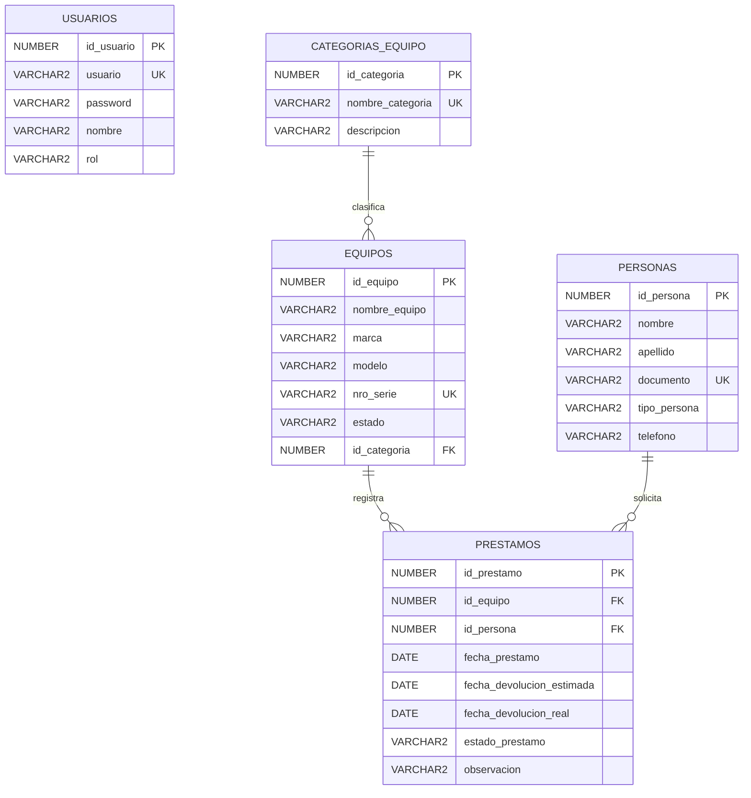

# DER - Base De Datos

Diagrama Entidad-Relacion del sistema de control de prestamos de equipos.

## Diagrama

## Entidades

### USUARIOS

Tabla usada para autenticacion del sistema.

- PK: `id_usuario`
- UK: `usuario`
- Uso principal: login.

### CATEGORIAS_EQUIPO

Tabla catalogo para clasificar equipos tecnologicos.

- PK: `id_categoria`
- UK: `nombre_categoria`
- Relacion: una categoria puede tener muchos equipos.

### EQUIPOS

Entidad principal del sistema y CRUD obligatorio.

- PK: `id_equipo`
- UK: `nro_serie`
- FK: `id_categoria`
- Estados permitidos: `DISPONIBLE`, `PRESTADO`, `MANTENIMIENTO`
- Relacion: un equipo pertenece a una categoria y puede aparecer en muchos prestamos.

### PERSONAS

Solicitantes que pueden recibir equipos en prestamo.

- PK: `id_persona`
- UK: `documento`
- Tipos permitidos: `ESTUDIANTE`, `DOCENTE`, `ADMINISTRATIVO`
- Relacion: una persona puede tener muchos prestamos.

### PRESTAMOS

Registro de prestamos y devoluciones.

- PK: `id_prestamo`
- FK: `id_equipo`
- FK: `id_persona`
- Estados permitidos: `ACTIVO`, `DEVUELTO`
- Guarda fecha de prestamo, fecha estimada y fecha real de devolucion.

## Relaciones

| Relacion | Cardinalidad | Explicacion |
| --- | --- | --- |
| `CATEGORIAS_EQUIPO` a `EQUIPOS` | 1 a N | Una categoria puede clasificar muchos equipos. Cada equipo pertenece a una categoria. |
| `EQUIPOS` a `PRESTAMOS` | 1 a N | Un equipo puede tener muchos prestamos historicos. Cada prestamo corresponde a un equipo. |
| `PERSONAS` a `PRESTAMOS` | 1 a N | Una persona puede solicitar muchos prestamos. Cada prestamo corresponde a una persona. |

## Reglas Importantes

- `USUARIOS` no se relaciona con prestamos porque en este alcance solo se usa para iniciar sesion.
- `EQUIPOS.estado` se actualiza automaticamente desde el backend:
  - Al registrar prestamo: `PRESTADO`.
  - Al registrar devolucion: `DISPONIBLE`.
- `PRESTAMOS.estado_prestamo` indica si el prestamo sigue activo o ya fue devuelto.
- Las claves primarias se generan con secuencias y triggers en Oracle.
